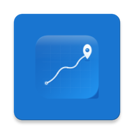
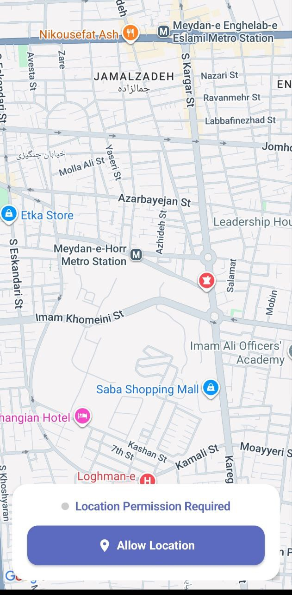
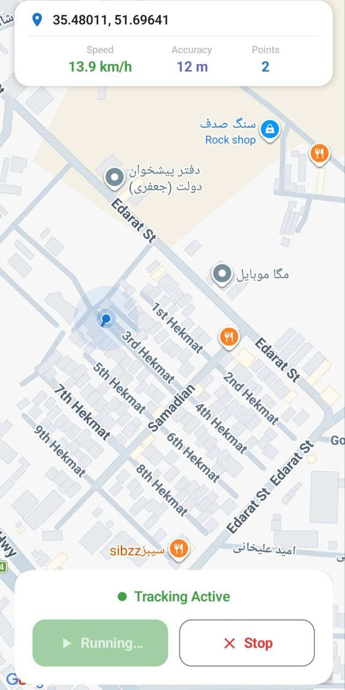
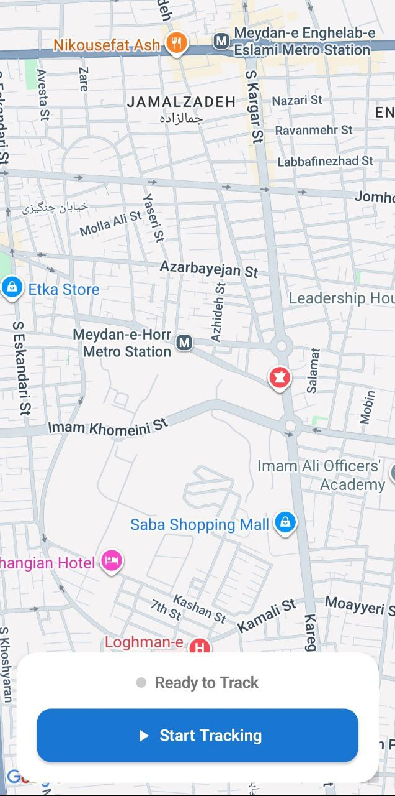

<p align="center">
  
</p>

<h1 align="center">GeoPulse</h1>

<p align="center">
  <strong>Smart Motion-Based Location Tracker for Android</strong>
</p>

<p align="center">
  
  
  
  
  
</p>

<p align="center">
  <em>GeoPulse uses your phone's accelerometer to detect physical movement — GPS only activates when you're actually moving, saving battery and eliminating jitter when stationary.</em>
</p>

---

## ✨ Features

📱 **Accelerometer-Based Motion Detection** — Uses hardware accelerometer with low-pass gravity filter to detect real physical movement. Phone on desk = zero GPS updates.

📍 **Live Map Tracking** — Real-time position displayed on Google Maps with animated pulsing dot

🛤️ **Route Visualization** — Movement path drawn as a polyline with shadow depth effect

📊 **Live Info Panel** — Coordinates and point count shown in real-time

🔋 **Battery Efficient** — GPS stays passive until accelerometer confirms movement. No movement = no GPS drain.

🛡️ **Real-Time Permission Monitoring** — Detects permission revocation and GPS toggle changes instantly, even mid-tracking. Shows warning cards with direct links to settings.

🏗️ **Modular Architecture** — Location engine is a standalone `:core:location` module, completely decoupled from the app

🚫 **No Google MyLocation** — Custom location dot with pulse animation instead of Google's built-in blue dot

---

## 🏛️ Architecture

```
┌──────────────────────────────────────────────────────────┐
│                     app (GeoPulse)                        │
│                                                          │
│  ┌──────────┐    ┌──────────────┐    ┌────────────────┐  │
│  │  Screen   │◄──│  ViewModel   │◄──│    Service      │  │
│  │ (Compose) │   │  (StateFlow) │   │   Connector     │  │
│  └──────────┘    └──────┬───────┘    └───────┬────────┘  │
│                         │                     │          │
│         ┌───────────────┘                     │          │
│         │ Permission & GPS Monitor            │          │
│         │ (1s polling + BroadcastReceiver)     │          │
│         │                                     │          │
├─────────┼─────────────────────────────────────┼──────────┤
│         │         core:location               │          │
│         │                                     ▼          │
│         │  ┌─────────────────────────────────────────┐   │
│         │  │           GeoLocationService             │   │
│         │  │         (Foreground Service)              │   │
│         │  └──────────────────┬────────────────────────┘   │
│         │                     │                            │
│         │  ┌──────────┐  ┌────▼──────┐  ┌──────────────┐  │
│         │  │ Location │  │ Location  │  │GPS DataSource │  │
│         │  │  Client  │◄─│   Repo    │◄─│(LocationMgr)  │  │
│         │  └──────────┘  └────┬──────┘  └──────────────┘  │
│         │                     │                            │
│         │              ┌──────▼────────┐                   │
│         │              │  Movement     │                   │
│         │              │  Detector     │                   │
│         │              │ (Accelerometer)│                   │
│         │              │               │                   │
│         │              │ Moving → GPS  │                   │
│         │              │ Still → Block │                   │
│         │              └───────────────┘                   │
└──────────────────────────────────────────────────────────┘
```

---

## 🛠️ Tech Stack

| Layer | Technology |
|-------|-----------|
| UI | Jetpack Compose + Material 3 |
| Map | Google Maps SDK + Maps Compose |
| DI | Hilt (Dagger) |
| Async | Kotlin Coroutines + Flow + channelFlow |
| Location | Android LocationManager (raw GPS) |
| Motion | Hardware Accelerometer (low-pass gravity filter) |
| Service | Foreground Service |
| Architecture | Clean Architecture (MVVM) |

---

## 📦 Module Structure

```
GeoPulse/
├── app/                          # Main application
│   └── ui/
│       ├── MapScreen.kt          # Map UI + permission warning cards
│       ├── MapViewModel.kt       # State + permission/GPS monitoring
│       └── MapUiState.kt         # UI state model
│
├── core/
│   ├── common/                   # Shared utilities
│   └── location/                 # 📍 Standalone location module
│       ├── api/                  # Public interface (LocationClient)
│       ├── domain/
│       │   ├── entity/           # GeoPoint, MotionState
│       │   ├── repository/       # LocationRepository interface
│       │   └── usecase/          # ObserveMovingLocationUseCase
│       ├── data/
│       │   ├── dataSource/       # GPS raw data source
│       │   ├── sensor/           # 📱 MovementDetector (accelerometer)
│       │   ├── filter/           # MotionFilter (distance-based)
│       │   └── repository/       # LocationRepositoryImpl
│       ├── service/              # GeoLocationService
│       ├── config/               # MotionConfig (thresholds)
│       └── di/                   # Hilt modules
```

---

## 📱 Motion Detection

GeoPulse uses a **two-layer approach** for motion detection:

### Layer 1: Accelerometer (MovementDetector)
The hardware accelerometer determines if the phone is physically moving. A low-pass filter removes gravity, leaving only linear acceleration.

| Parameter | Value | Description |
|-----------|-------|-------------|
| `MOVE_THRESHOLD` | 0.35 m/s² | Minimum acceleration to detect movement |
| `MOVE_COUNT_TRIGGER` | 5 samples | Consecutive samples needed to confirm movement |
| `STILL_TIMEOUT_MS` | 4000 ms | Duration without movement before declaring stationary |

### Layer 2: GPS (GpsLocationDataSource)
When the accelerometer confirms movement, GPS locations are emitted directly to the map. GPS stays always-on but emissions are gated by the accelerometer state.

```
Phone on desk → Accelerometer: still → GPS blocked → zero updates
Pick up & walk → Accelerometer: moving → GPS emits → map updates
Stop & put down → 4s timeout → Accelerometer: still → GPS blocked
```

---

## 🛡️ Permission & GPS Monitoring

GeoPulse continuously monitors location access and responds instantly:

- **GPS toggle** — `BroadcastReceiver` on `PROVIDERS_CHANGED_ACTION` detects GPS on/off immediately
- **Permission changes** — Polling every 1 second catches permission revocation mid-tracking
- **Auto-stop** — Service stops automatically when permission or GPS is lost
- **Warning cards** — Full-screen card with action buttons appears when access is missing
  - "Grant Permission" → system permission dialog
  - "Open App Settings" → app settings page (for permanently denied)
  - "Open GPS Settings" → device location settings

---

## 🚀 Getting Started

### Prerequisites
- Android Studio Ladybug or newer
- Min SDK 24 (Android 7.0)
- Google Maps API Key

### Setup

**1.** Clone the repository:
```bash
git clone https://github.com/your-username/GeoPulse.git
cd GeoPulse
```

**2.** Add your Google Maps API key in `local.properties`:
```properties
MAPS_API_KEY=your_api_key_here
```
Or directly in `AndroidManifest.xml`:
```xml
<meta-data
    android:name="com.google.android.geo.API_KEY"
    android:value="YOUR_API_KEY"/>
```

**3.** Build and run:
```bash
./gradlew assembleDebug
```

### Permissions

The app requires:
```xml
<uses-permission android:name="android.permission.ACCESS_FINE_LOCATION"/>
<uses-permission android:name="android.permission.ACCESS_COARSE_LOCATION"/>
<uses-permission android:name="android.permission.FOREGROUND_SERVICE"/>
<uses-permission android:name="android.permission.POST_NOTIFICATIONS"/>  <!-- API 33+ -->
```

---

## 📸 Screenshots

| Ready | Tracking | Route |
|:-----:|:--------:|:-----:|
|  |  |  |

---

## 🔧 Build Variants

| Variant | MinifyEnabled | ShrinkResources | Size |
|---------|:------------:|:---------------:|:----:|
| Debug | ❌ | ❌ | ~16 MB |
| Release | ✅ | ✅ | ~8-10 MB |

---

## 📄 License

```
MIT License

Permission is hereby granted, free of charge, to any person obtaining a copy
of this software and associated documentation files (the "Software"), to deal
in the Software without restriction, including without limitation the rights
to use, copy, modify, merge, publish, distribute, sublicense, and/or sell
copies of the Software, and to permit persons to whom the Software is
furnished to do so, subject to the following conditions:

The above copyright notice and this permission notice shall be included in all
copies or substantial portions of the Software.
```

---

<p align="center">
  Made with ❤️
</p>
